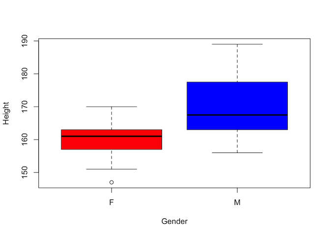
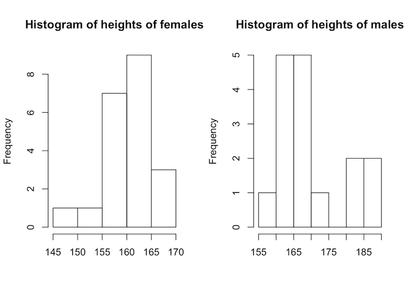

---
# Please do not edit this file directly; it is auto generated.
# Instead, please edit 05-Continuous-Variable.md in _episodes_rmd/
title: "Comparison Between Two Groups"
teaching: 45
exercises: 10
questions:
- "Do two sample groups differ for a continuous trait?"
objectives:
- "Tests for use with comparison of two groups of continuous data"
- "Summarising continuous data graphically"
- "Selecting and using relevant statistical tests"
keypoints:
- "Use `hist` and boxplots to review distribution of variables for a group"
- "Summarise grouped data using the `by` command"
- "Distinguish paired and non-paired samples"
- "Correctly use the `t.test` and `wilcox.test` functions"
output: html_document
---


## Comparison of two sample groups

Earlier we discussed continuous data, and how to investigate relationships 
(correlations) between two continuous variables. In this section, we will learn 
how to identify whether a single continuous trait differs between two sample 
groups - a two sample test. Specifically, we will investigate whether there is a
statistically-significant difference between the distribution of that variable 
between the two groups. As an example, we will test whether male patients in our
gallstones study are taller than female patients.

> ## Discussion
>
> See if you can identify other examples where you might use a two sample groups
> comparison. Do you have any in your own research?
{: .discussion}

### Choosing the relevant test

As with testing for categorical variables, there are a range of different 
statistical analyses for two sample group comparisons; the appropriate one to 
use is determined by the nature of the dataset. There are two primary questions
we need to ask to identify the relevant test: are the two datasets 
normally-distributed, and are the data paired (that is, are there repeated
measurements on the same samples)? The figure below summarises the choice of
statistical test used for each of these cases.


The first step is to determine whether the continuous variable in each group is
normally distributed. We've already learned about the `shapiro.test` function to 
test for normality, and can use that again in this situation.

The second decision is to identify whether the data is paired or not. Paired 
data is when the two groups are the same test samples but measured under 
different conditions (for example, a group of patients tested before and after 
treatment), unpaired is when the two groups are independent (for example, two 
separate groups of patients, one group treated and one untreated). 

There are a few further subtleties beyond this which we will come to in a 
moment, but these are the two major determining factors in choosing the correct
test.


> ## Challenge 1
>
> In our gallstones dataset, assume that BMI is normally distributed for
> patients with a recurrence of gallstones and not normal for those with no 
> recurrence. Which test would we use to investigate whether those two groups
> (with and without recurrence) had different BMIs?
> > ## Solution to Challenge 1
> > 
> > One data set is normally distributed, the other is not, so we choose the 
> > option for non-normally distributed data - the branch to the right (we can 
> > only answer yes to the first question if both datasets are normal). The data
> > is not paired - the patients with recurrence are a different group to those
> > without. In this case we would use the Mann-Whitney test.
> {: .solution}
{: .challenge}

## Two sample Student's T-test

If data is normally distributed for **both** groups, we will generally use the 
Student's T-test. This compares the means of two groups measured on the same 
continuous variable. Tests can be two-sided (testing whether the groups are not
equal) or one-sided (testing either whether the second group is greater than or
less that the first). As we discussed in the introduction, generally a two-sided
test is preferred unless there is a specific reason why a single-sided one is
justified.

H<sub>0</sub>: µ<sub>1</sub> = µ<sub>2</sub> | against | H<sub>1</sub>: 
µ<sub>1</sub> ≠ µ<sub>2</sub> (two-sided)
 | or | 
H<sub>0</sub>: µ<sub>1</sub> <= µ<sub>2</sub> | against | H<sub>1</sub>: 
µ<sub>1</sub> > µ<sub>2</sub> (greater)
 | or | 
H<sub>0</sub>: µ<sub>1</sub> >= µ<sub>2</sub> | against | H<sub>1</sub>: 
µ<sub>1</sub> < µ<sub>2</sub> (less)

If **equal variance**: Student's T-test  
If **unequal variance**: Welch's two-sample T-test  
If **data are paired**: Student's paired T-test  

> ## Tip
> The R `t.test` function combines all three of these tests, and defaults to 
> Welch's two-sample T-test. To perform a standard T-test, use the parameter 
> setting `var.equal = TRUE`, and for a paired T-test, use `paired = TRUE`. 
{: .callout}

## Two sample Mann-Whitney test

Unless **both** groups are normally distributed, use the Mann-Whitney test. This
is a non-parametric test analogous to the unpaired T-test, used when the 
_dependent_ variable is non-normally distributed

The Mann-Whitney test compares the medians of the two groups rather than the 
means, by considering the data as rank order values rather than absolute values.

> ## Tip
> The `wilcox.test` function in R defaults to unpaired data - effectively 
> returning the Mann-Whitney test instead. Carry out a paired Wilcox test with 
> the `paired = TRUE` argument
{: .callout}

## Two sample test example

Is there a difference in height between females and males in the gallstones 
dataset? 

Height: Continuous variable  
Gender: Categorical variable with two levels  
Null hypothesis: There is no difference in height between the groups  

_Step one - visualise the data_  
We will start by reviewing the data using a boxplot to see if there is an 
indication of difference between the groups

```r
plot(gallstones$Height ~ gallstones$Gender, 
     col=c('red','blue'),
     ylab = 'Height',
     xlab = 'Gender')
```


Visually there certainly appears to be a difference. But is it statistically
significant?

_Step two - is the data normally distributed?_  

```r
par(mfrow=c(1,2))
hist(gallstones$Height[which(gallstones$Gender == 'F')], main = "Histogram of heights of females", xlab = "")
hist(gallstones$Height[which(gallstones$Gender == 'M')], main = "Histogram of heights of males", xlab = "")
```


This doesn't look very normally-distributed, but we do have relatively few data
points. A more convincing way to determine this would be with the Shapiro-Wilks
test

```r
by(gallstones$Height, gallstones$Gender, shapiro.test)
```

~~~
## gallstones$Gender: F
## 
## 	Shapiro-Wilk normality test
## 
## data:  dd[x, ]
## W = 0.94142, p-value = 0.2324
## 
## ------------------------------------------------------------ 
## gallstones$Gender: M
## 
## 	Shapiro-Wilk normality test
## 
## data:  dd[x, ]
## W = 0.88703, p-value = 0.05001
~~~
{: .output}

Neither test gives a significant p-value, so in the absence of sufficient 
evidence to accept the alternative hypothesis of non-normality, we treat the
data as if it were normal; that is, we use a T-test 

_Step three - are variances equal?_  

```r
by(gallstones$Height, gallstones$Gender, sd)
```

~~~
## gallstones$Gender: F
## [1] 5.518799
## ------------------------------------------------------------ 
## gallstones$Gender: M
## [1] 9.993331
~~~
{: .output}

The standard deviations of the two groups (and hence the variances) don't seem 
to be equal, so we should use a Welch's two-sample T-test. This is the default
option for the `t.test` function anyway

_Step four - carry out a T-test_  

```r
t.test(gallstones$Height ~ gallstones$Gender)
```

~~~
## 
## 	Welch Two Sample t-test
## 
## data:  gallstones$Height by gallstones$Gender
## t = -3.3996, df = 21.894, p-value = 0.002587
## alternative hypothesis: true difference in means is not equal to 0
## 95 percent confidence interval:
##  -15.181960  -3.675183
## sample estimates:
## mean in group F mean in group M 
##        160.5714        170.0000
~~~
{: .output}

**Conclusion**: the p-value is significant so we can accept the alternative 
hypothesis and conclude that there is a difference in the mean height of males
and females in our dataset.


> ## Challenge 2
> 
> Using the gallstones dataset, test whether the gallstone diameter ("Diam") is
> different between patients who suffer a recurrence and those who do not.
> > ## Solution to Challenge 2
> > 
> > 
> > ```r
> > # Visualise data
> > plot(gallstones$Diam ~ gallstones$Rec, col = c("red","blue"),
> >      ylab = "Diameter",
> >      xlab = "Recurrence")
> > # Test whether data is normally distributecd
> > by(gallstones$Diam, gallstones$Rec, shapiro.test)
> > ```
> > Data is not normal for the recurrence group, and data is not paired - hence
> > Mann-Whitney test
> > 
> > ```r
> > # Use wilcox.test function which defaults to Mann-Whitney analysis
> > wilcox.test(gallstones$Diam ~ gallstones$Rec, exact=FALSE)
> > ```
> > The p-value is not significant, so we do not have sufficient evidence to 
> > reject the null hypothesis that there is no difference in gallstone size
> > between the two groups.
> {: .solution}
{: .challenge}

## Group descriptions

If there is a significant difference between the two groups (or even if there
isn't) it is often useful to generate some summary statistics for each group. 
We can do this with the `by` command, which we've used already in this section, 
combined with summary functions


```r
# For normally distributed data, report the mean and standard deviation
by(gallstones$Height, gallstones$Gender, mean)
```

~~~
## gallstones$Gender: F
## [1] 160.5714
## ------------------------------------------------------------ 
## gallstones$Gender: M
## [1] 170
~~~
{: .output}

```r
by(gallstones$Height, gallstones$Gender, sd)
```

~~~
## gallstones$Gender: F
## [1] 5.518799
## ------------------------------------------------------------ 
## gallstones$Gender: M
## [1] 9.993331
~~~
{: .output}


```r
# For non-normally distributed data, report the median and inter-quartile range
by(gallstones$Diam, gallstones$Rec, median)
```

~~~
## gallstones$Rec: NoRecurrence
## [1] 10
## ------------------------------------------------------------ 
## gallstones$Rec: Recurrence
## [1] 8.5
~~~
{: .output}


```r
by(gallstones$Diam, gallstones$Rec, IQR)
```

~~~
## gallstones$Rec: NoRecurrence
## [1] 12
## ------------------------------------------------------------ 
## gallstones$Rec: Recurrence
## [1] 9
~~~
{: .output}


## Paired samples
If data is paired, that is, it is the same samples under two different 
conditions, we can take advantage of that to carry out statistical tests with 
greater discriminatory power. That is because by using paired samples, we remove
a lot of the noise that can otherwise obscure our results. Paired data must have
the same number of results in each group, there must be a one-to-one relationship
between the groups (every sample that appears in one group must appear in the 
other), and the data must be the same sample order in each group.

Otherwise, paired sample analysis is performed in a similar way to unpaired 
analysis. The main difference is to add the `paired = TRUE` argument to the 
`t.test` or `wilcox.test` function.
