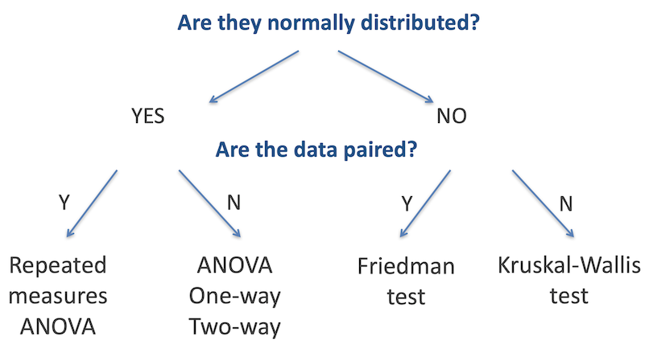
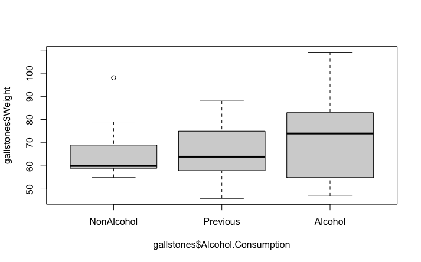

---
# Please do not edit this file directly; it is auto generated.
# Instead, please edit 06-ANOVA.md in _episodes_rmd/
title: "Testing For More Than Two Samples"
teaching: 45
exercises: 10
questions:
- "Are the group means different among three or more groups?"
objectives:
- "Identify situations needing multiple sample tests and choose the correct test 
for the type of data"
- "Perform one and two-way ANOVA testing"
- "Recognise interaction effects in multiple-category testing"
- "Interpret test results and apply post hoc testing"
keypoints:
- ""
output: html_document
---

Episode topics
Decision tree – ANOVA, Kruskal-Wallis, Friedman
ANOVA one-way: like T-test but with 3 or more groups
Post-hoc testing
Correction of multiple testing effects
ANOVA two-way: like T-test but with 2 or more categories
Interaction effects and analysis
Learning outcomes
Identify situations needing multiple sample tests
Choose the correct test for the type of data
Perform one and two-way ANOVA testing
Recognise interaction effects in multiple-category testing
Interpret test results and apply post hoc testing


## Comparison of multiple groups

The T-test, Mann-Whitney Test and others discussed earlier are designed to 
identify differences in the means or medians of two groups. When working with 
data that is in three or more groups, where we are testing if there is a 
difference between any one of those groups with the others, we need to use other
tests. As with two-sample testing, the appropriate test is determined in large
part by whether the data in each group is normally distributed, and whether the
data is paired, as outlined in the figure below.



> ## Challenge 1
>
> Based on what you have learned previously in this workshop, how can we best
> determine whether the data in each sample is normally distributed
> > ## Solution to Challenge 1
> > 
> > We can use the `shapiro.test` function to test for normality - or rather, to 
> > test the alternative hypothesis that the data is not normally distributed. 
> > Use the `by` function to test all categories in one command: 
> > 
> > ```r
> > by(data$measurement, data$category, shapiro.test)
> > ```
> > Remember, as with the two sample tests, if any one group is not normally
> > distributed, the whole analysis must be performed with the relevant 
> > non-parametric test
> {: .solution}
{: .challenge}

## ANOVA Testing - One-way

The one-way ANOVA compares whether there is a difference in the mean values of 
three or more groups. It requires one continuous (and normally distributed) 
measurement variable, and one categorical variable (with three or more 
categories). 

Assumptions for the one-way ANOVA are:
* Independant samples
* Normal distribution in each group
* Homogeneity of variances

The null hypothesis for one-way ANOVA is that the means of all groups are equal;
the null hypothesis is that at least one of the means is different from the 
others.

H<sub>0</sub>: µ<sub>1</sub> = µ<sub>2</sub> = µ<sub>3</sub> = ... = µ<sub>k<sub>  
H<sub>1</sub>: µ<sub>1</sub> ≠ µ<sub>2</sub> OR µ<sub>1</sub> ≠ µ<sub>3</sub> OR 
µ<sub>2</sub> ≠ µ<sub>3</sub> ....

The ANOVA extension of the t-test is called the **F-test**, and is based around 
decomposing the total variation in the sample into the variability (sum of 
squares) within groups and between groups


## ANOVA one-way example

In our example dataset, the alcohol consumption field has three categories. We 
will test if there is any effect on weight associated with the alcohol 
consumption category.

### Variables of interest
* Alcohol consumption: Categorical (1, 2 or 3)
* Weight: Continuous

There are two variables - one categorical with more than two levels and one 
continuous. The data are not paired - all the measurements are from different 
patients. So based on the decision tree, the appropriate test is either one-way
ANOVA or Kruskal-Wallis test. The choice between these is made depending on 
whether the data is normally distributed or not

```r
by(gallstones$Weight, gallstones$Alcohol.Consumption, shapiro.test)
```

~~~
## gallstones$Alcohol.Consumption: 1
## 
## 	Shapiro-Wilk normality test
## 
## data:  dd[x, ]
## W = 0.79876, p-value = 0.01976
## 
## ------------------------------------------------------------ 
## gallstones$Alcohol.Consumption: 2
## 
## 	Shapiro-Wilk normality test
## 
## data:  dd[x, ]
## W = 0.95864, p-value = 0.7703
## 
## ------------------------------------------------------------ 
## gallstones$Alcohol.Consumption: 3
## 
## 	Shapiro-Wilk normality test
## 
## data:  dd[x, ]
## W = 0.94549, p-value = 0.3588
~~~
{: .output}

The Shapiro test for group 1 gives a significant p-value, indicating that we 
should reject the null hypothesis that the data is normally distributed. This 
would indicate that the Kruskal-Wallis test is the appropriate one for this 
analysis


```r
kruskal.test(gallstones$Weight ~ gallstones$Alcohol.Consumption)
```

~~~
## 
## 	Kruskal-Wallis rank sum test
## 
## data:  gallstones$Weight by gallstones$Alcohol.Consumption
## Kruskal-Wallis chi-squared = 0.89142, df = 2, p-value = 0.6404
~~~
{: .output}

```r
plot(gallstones$Weight ~ gallstones$Alcohol.Consumption)
```



We can see that with a p-value of 0.64, we reject the alternative hypothesis and
concluded that in this data set, there is no evidence for a difference in 
patient weight associated with their level of alcohol consumption. This is 
consistent with the plot, which doesn't show any clear differences between the
three categories.

For comparison and practice, let's also perform an ANOVA

```r
result <- aov(gallstones$Weight~gallstones$Alcohol.Consumption)
summary(result)
```

~~~
##                                Df Sum Sq Mean Sq F value Pr(>F)
## gallstones$Alcohol.Consumption  2    369   184.4   0.685  0.511
## Residuals                      34   9151   269.1
~~~
{: .output}

Like the Kruskal-Wallis test, this ANOVA also gives a non-significant p-value, 
but remember, it is not the appropriate test for non-normally distributed data
so would not be a valid test anyway.

### _Post-Hoc_ testing
The one-way ANOVA and Kruskal-Wallis tests only identify that one (or more) of 
the groups has a significant difference to the others. To go further, we would
want to identify which group(s) were different. For this we would use a 
**_Post-hoc_ test**, either Tukeys' HSD for ANOVA or Dunn's test (in the 
PMCMRplus package) for Kruskal-Wallis. This performs a multiple-testing 
corrected pairwise comparison between each combination of groups to highlight 
which (if any) are different.


```r
# Dunn's test, since we used Kruskal-Wallis for the initial analysis
library(PMCMRplus)
kwAllPairsDunnTest(x=gallstones$Weight, g=as.integer(gallstones$Alcohol.Consumption), 
                   p.adjust.method="bonferroni")
```

```
## Warning in kwAllPairsDunnTest.default(x = gallstones$Weight, g =
## as.integer(gallstones$Alcohol.Consumption), : Ties are present. z-quantiles were
## corrected for ties.

## 
## 	Pairwise comparisons using Dunn's all-pairs test

## data: gallstones$Weight and as.integer(gallstones$Alcohol.Consumption)

##   1 2
## 2 1 -
## 3 1 1

## 
## P value adjustment method: bonferroni

## alternative hypothesis: two.sided
~~~
{: .output}

The row and column headers show the group identifiers, and the values in the 
table are the p-values. In this case, the p-values are all 1 - there is not
evidence for even a suggestion of differences between the groups!

> ## Challenge 2
>
> For a more interesting analysis, try creating a dummy dataset with the weight 
> of patients doubled for just one category of Alcohol.Consumption and then 
> repeat the Kruskal-Wallis and Dunn's tests. Does this show a significant 
> difference as you might expect?
> > 
> > 
> > ```r
> > # Create a copy of the gallstones data frame so as not to break things later
> > dummy_data <- gallstones
> > # Double the weight for Alcohol.Consumption = 3
> > ac_three <- which(gallstones$Weight == 3)
> > dummy_data[ac_three, "Weight"] <- dummy_data[ac_three, "Weight"] * 2
> > # Then do the testing
> > kruskal.test(dummy_data$Weight ~ dummy_data$Alcohol.Consumption)
> > kwAllPairsDunnTest(x=dummy_data$Weight, g=dummy_data$Alcohol.Consumption,
> >                    p.adjust.method="bonferroni")
> > ```
> {: .solution}
{: .challenge}

If there is a significant p-value with a one-way ANOVA, use the Tukey HSD test

```r
TukeyHSD(result)
```

~~~
##   Tukey multiple comparisons of means
##     95% family-wise confidence level
## 
## Fit: aov(formula = gallstones$Weight ~ gallstones$Alcohol.Consumption)
## 
## $`gallstones$Alcohol.Consumption`
##           diff       lwr      upr     p adj
## 2-1 -0.2777778 -18.74892 18.19336 0.9992516
## 3-1  6.1666667 -10.24537 22.57870 0.6311298
## 3-2  6.4444444  -9.41109 22.29998 0.5844049
~~~
{: .output}

The layout here is different to the Dunn's test with one row per comparison
rather than a grid format, but the principle is the same, with the p-value
reported for each pairwise comparison

> ## Challenge 3
>
> Try using the dummmy dataset from challenge 2 for an ANOVA and Tukey's test
> > 
> > 
> > ```r
> > dummy_result <- aov(dummy_data$Weight ~ dummy_data$Alcohol.Consumption)
> > summary(dummy_result)
> > TukeyHSD(dummy_result)
> > ```
> {: .solution}
{: .challenge}

